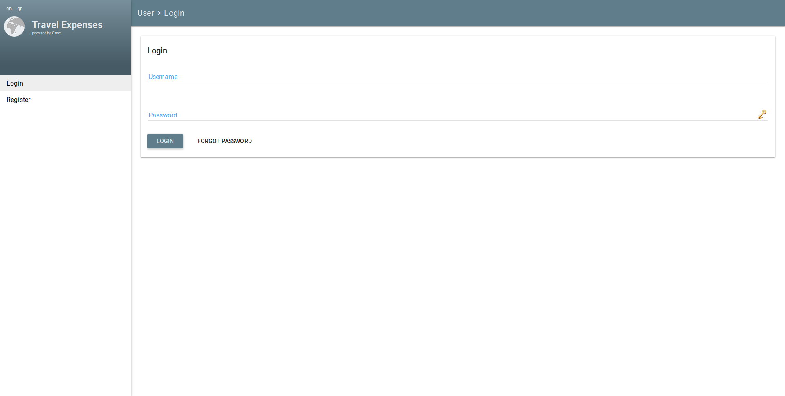
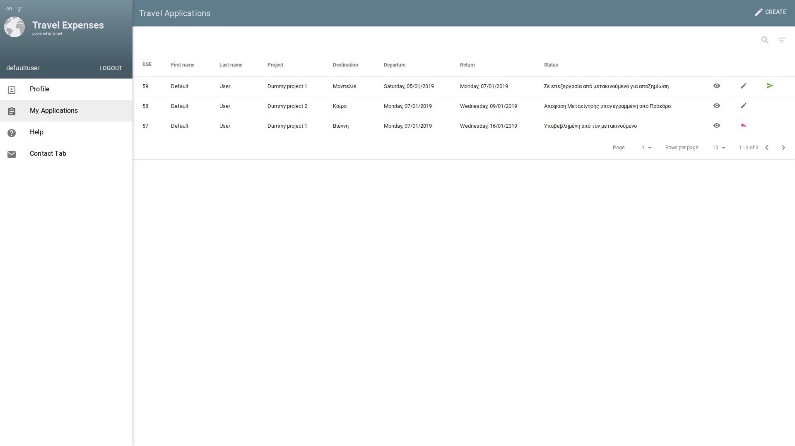
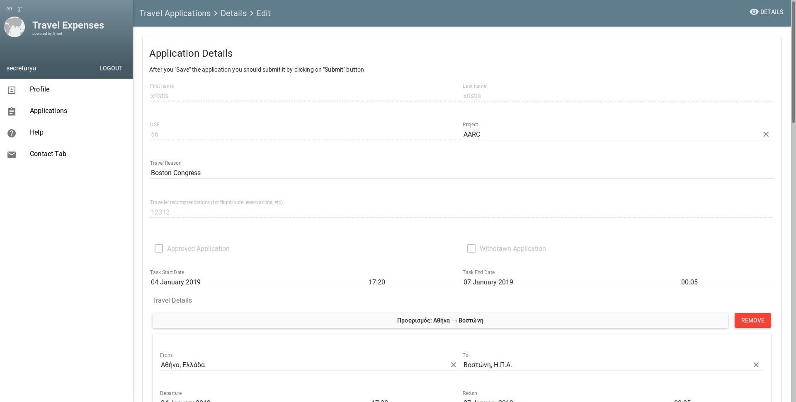

# Travel Expenses

The electronic service [Travel Expenses](https://travelexpenses.grnet.gr/ui/auth/login) provides a simple way to organize business trips (according to law 4336/2015) starting from the planning process to the final listing of the trips' expenses.

## Prerequisites

* Python 2.7
* git
* pip
* Yarn

On a Debian Stretch system, the following packages are also required:
* libcairo2
* libpango-1.0-0
* pangocairo-1.0
* libffi-dev

## Development Instructions

### Backend installation

#### Getting the repo and installing dependencies

* Clone this repo and checkout to `develop` branch
* Install python dependencies (it's highly recommended to use a virtualenv)
```
$ cd travelsBackend
$ pip install -r requirements.txt
```

#### Configuration

* Create a `settings.conf` file. The default path for it is `/etc/travel`. The path can be overriden by setting the `TRAVEL_SETTINGS_DIR` shell variable. This file overrides Django's `settings.py` and it should contain at least the following lines (change IP accordingly):
```
EMAIL_BACKEND = 'django.core.mail.backends.filebased.EmailBackend'
EMAIL_FILE_PATH = './emails'

DEBUG = True
TEMPLATE_DEBUG = DEBUG

ALLOWED_HOSTS = [u'SERVICE.IP.HERE']
HOST_URL = [u'SERVICE.IP.HERE-with-http-and-port']
```

* The service expects a resources directory at `/usr/lib/travel/resources`. Those resources can be found in the resources directory in the root folder of the repo. The path can be overriden by setting the `TRAVEL_RESOURCES_DIR` shell variable.

* The service will try to create a logfile at `/var/log/travel/travelexpenses.log`. This path can be overriden by setting the `TRAVEL_LOGFILE` shell variable.

#### Database initialization

* Initialize database
```
$ python manage.py migrate
```

#### Running the server

* Use the following command:
```
$ python manage.py runserver
```
You can now view your api at [http://127.0.0.1:8000/api/](http://127.0.0.1:8000/api/)

#### Adding required data (Optional)

* It is recommended to add data about permissions, countries and tax offices by using the commands below:
```
$ python manage.py loaddata texpenses/fixtures/data.json
$ python manage.py loadlocations texpenses/data/countriesTZ.csv
$ python manage.py loadtaxoffices texpenses/data/ListEfories.csv
```

There's also a loadprojects management command to add projects from a csv, similar to loadlocations and loadtaxoffices.


* If the deployment is intended for development, you could also add dummy data about users and projects:
```
$ python manage.py loaddata texpenses/fixtures/dummy_user_project_data.json
```

The last command will create the following users with the corresponding credentials:

```
user                : 12345
secretary           : 12345
controller          : 12345
presidentsecretary  : 12345
manager             : 12345
helpdesk            : 12345
viewer              : 12345
admin               : 12345
```


## Frontend installation

### Install requirements

* Install dependencies by running `yarn`
```
$ cd travelsFront
$ yarn
```
* When yarn finishes, run `bower install` in order to install all bower components required (use the `--allow-root` option if required).
```
$ ./node_modules/.bin/bower install
```

* Build static files (use the --watch flag to keep the builder running and updating the build realtime)
```
$ ./node_modules/.bin/ember build --environment=development
```

You can now view the full app at [http://127.0.0.1:8000/](http://127.0.0.1:8000/)

## Screenshots

Below are some screenshots from an existing installation of Travel Expenses. You can view the login and register pages, as well as a list of a user's applications and an application form open for editing by a secretary role.


|  |
|:--:|
| Login |

|  |
|:--:|
| Register |

|  |
|:--:|
| Applications list |

|  |
|:--:|
| Application form screen |


## Copyright and License

Copyright (C) 2016-2019 GRNET S.A.

This program is free software: you can redistribute it and/or modify
it under the terms of the GNU Affero General Public License as published
by the Free Software Foundation, either version 3 of the License, or
(at your option) any later version.

This program is distributed in the hope that it will be useful,
but WITHOUT ANY WARRANTY; without even the implied warranty of
MERCHANTABILITY or FITNESS FOR A PARTICULAR PURPOSE.  See the
GNU Affero General Public License for more details.

You should have received a copy of the GNU Affero General Public License
along with this program.  If not, see <https://www.gnu.org/licenses/>.
